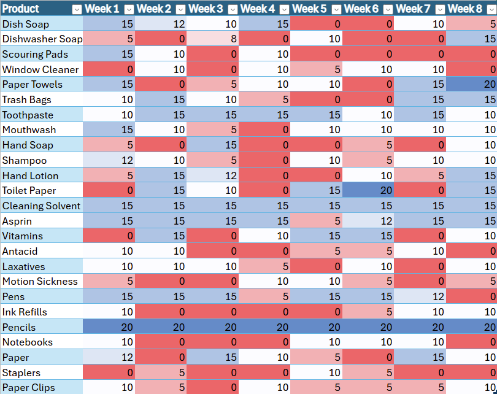
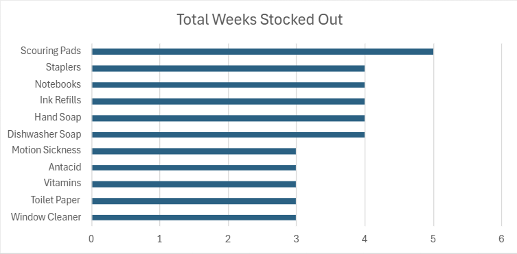
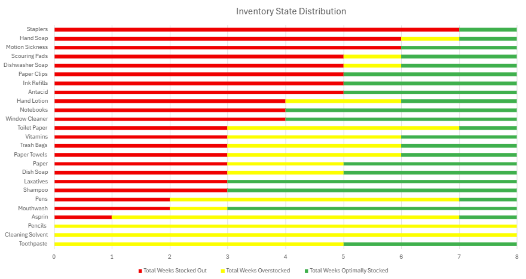
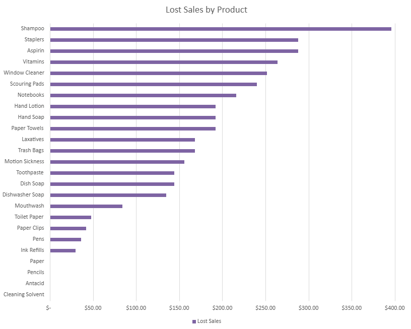
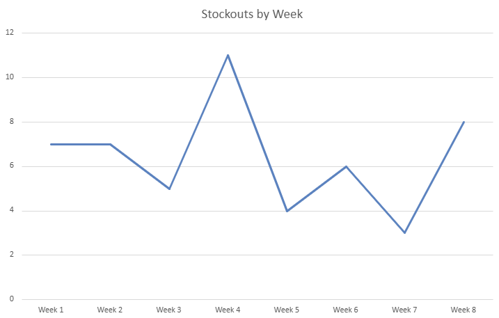
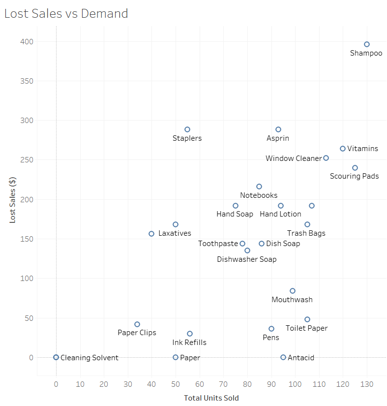
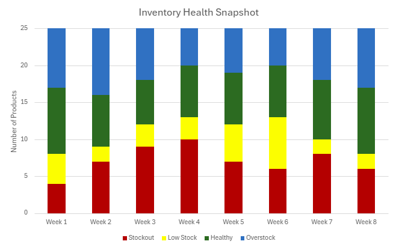
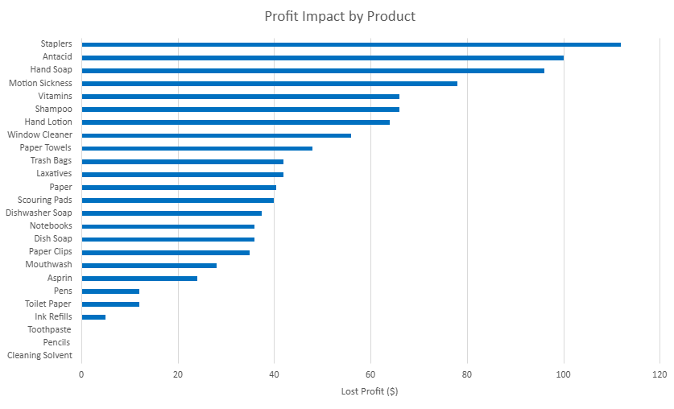
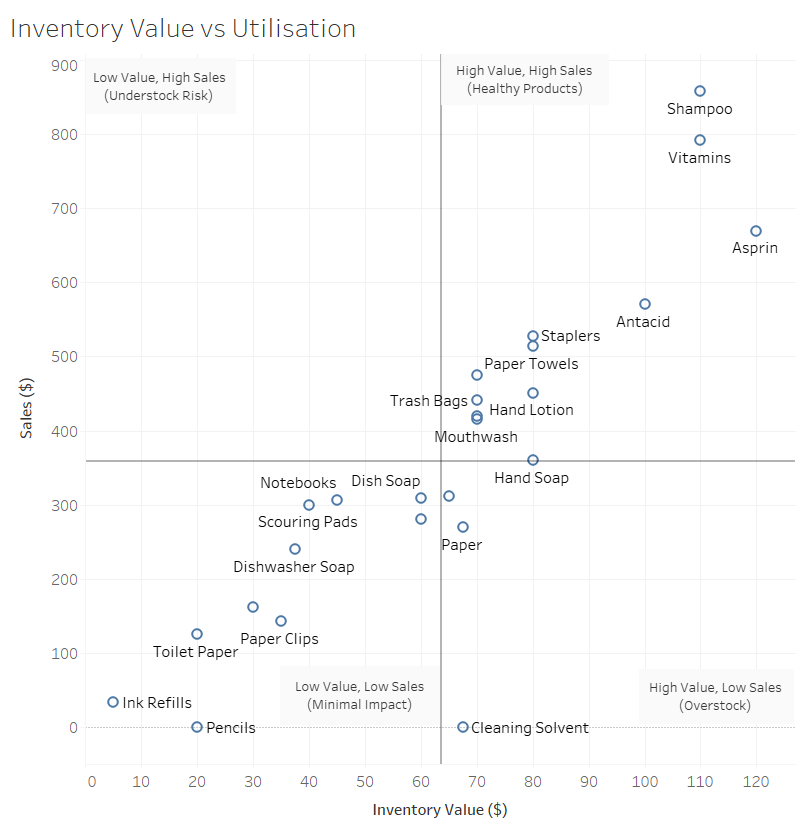

# 🛒 Retail Inventory Optimization Analysis

## 📌 Overview

This project analyzes inventory inefficiencies across a 10-store retail chain, **Super Shopper**.

The business faces widespread stockouts and overstocks, impacting:

* Revenue
* Customer satisfaction
* Operational efficiency

The analysis evaluates three core business functions:

* Warehouse Operations
* Point of Sale (POS)
* Accounting

---

## ❗ Business Problem

Super Shopper is experiencing:

* Frequent stockouts of high-demand products
* Overstocking of low-demand products
* Inefficient reorder processes

### 📉 Business Impact

* Lost sales revenue
* Increased product waste
* Poor customer experience

---

## 🔍 Key Insights

### 📦 Inventory Issues

* **44% of products** experienced stockouts
* Products were unavailable **~38% of the time** over an 8-week period
* Multiple products had **consecutive stockout weeks**, indicating supply chain delays

### 💰 Lost Revenue (POS)

* **$3,675 in lost sales** over 8 weeks (Store 2)
* No week without stockouts

### 📉 Overstocking

* Several products showed **zero movement (dead stock)**
* Inefficient use of shelf space and capital

### 📊 Accounting Impact

* **60% of products required restocking**
* Total reorder cost: **$820**
* Expected profit: **$164 (20% margin)**

---

## 🧠 Root Cause

* Static, one-size-fits-all reorder points
* Poor alignment between warehouse and store-level demand
* Delays in reordering and fulfillment

---

# 📊 Visual Analysis

## 🏬 Warehouse Insights

### Inventory Heatmap



### Stockout Frequency by Product



### Inventory State Distribution



---

## 🛒 Point of Sale (POS) Insights

### Lost Sales by Product



### Weekly Stockouts Trend



### Demand vs Lost Sales



---

## 💰 Accounting Insights

### Inventory Health Snapshot



### Profit Impact by Product



### Inventory Value vs Utilization



---

# 📈 Key Takeaways

* Inventory issues are **systemic**, not isolated
* Stockouts are the primary driver of **lost revenue**
* Overstocking leads to **inefficient capital allocation**
* Current processes fail to adapt to **store-level demand variability**

---

# ✅ Recommendations

### 1. Dynamic Inventory Forecasting

Shift from static to **store-specific demand forecasting**

### 2. Adjust Reorder Points

* Increase thresholds for high-demand products
* Decrease for low-demand products

### 3. Improve Supply Chain Responsiveness

Trigger earlier reorders to account for delays

### 4. Dead Stock Management

* Reduce non-moving inventory
* Reallocate shelf space

---

# 🛠 Tools & Skills Demonstrated

* Data Analysis (Excel)
* Data Visualization (Tableau)
* Inventory Optimization
* Business Analysis
* Data Storytelling

---

# 📁 Project Structure

```
/docs → Full case study reports  
/visuals → Charts and visualizations  
/data → Source datasets 
```

---

# 🚀 Future Improvements

* Rebuild analysis using Python (pandas)
* Automate inventory forecasting
* Develop interactive dashboards (Tableau / Power BI)
